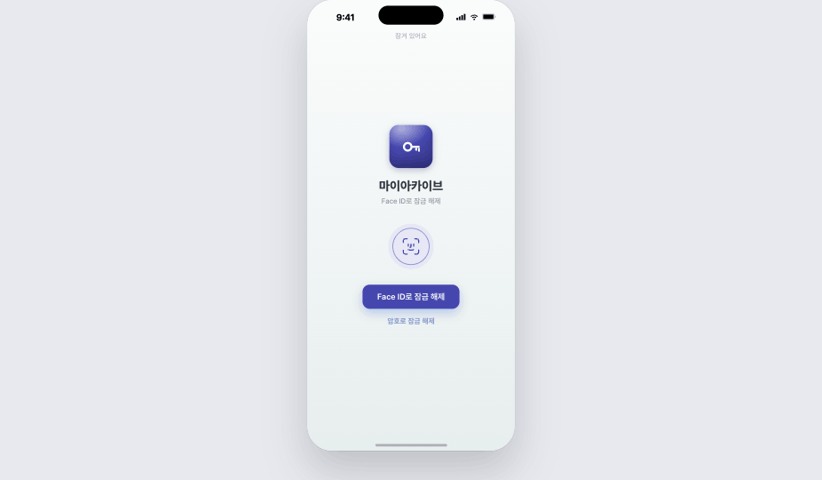
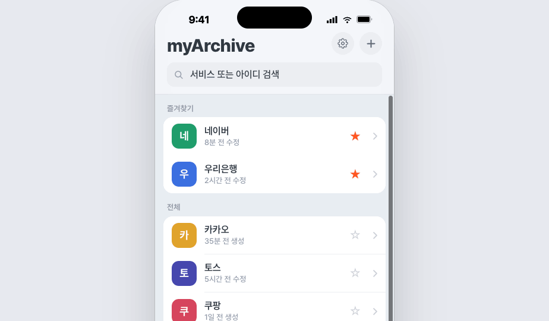
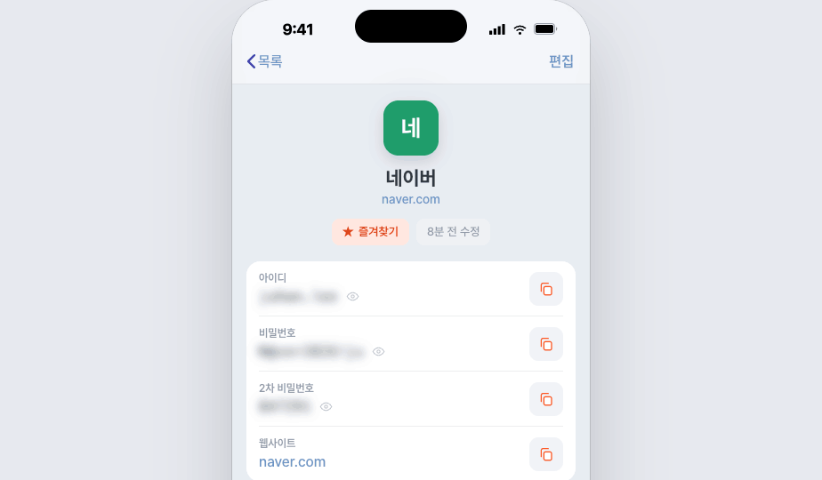
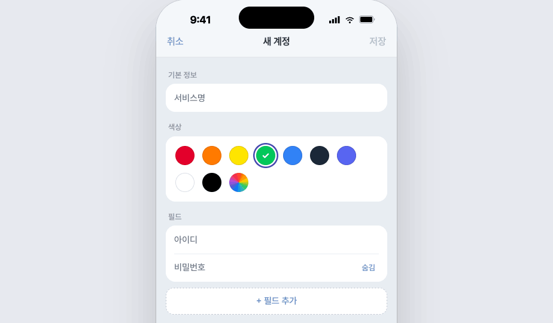
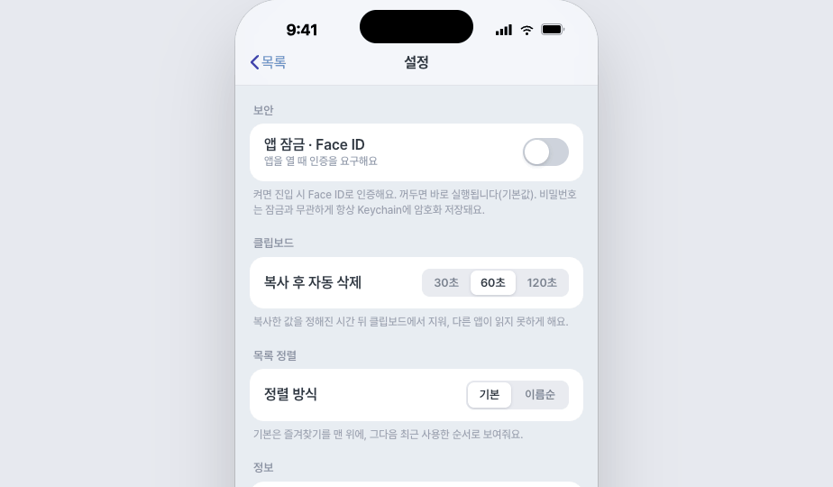

# myArchive

빠르고 가벼운 **로컬 전용 iOS 비밀번호 관리 앱**.

메모장에 평문으로 적어두던 계정 정보를, 1~2초 안에 검색하고 · 필드별로 한 번에 복사하고 · 필요한 값만 터치로 드러내며 · 선택적 앱 잠금으로 안전하게 다루기 위한 앱이다. PC방·자동완성이 안 되는 사이트·수동 로그인이 필요한 모바일 앱처럼 "급하게 계정 정보를 꺼내 써야 하는" 순간에 빠르게 찾아 쓰는 데 초점을 맞췄다.

## 화면

| 잠금 | 메인 목록 | 상세 | 추가·수정 | 설정 |
|:---:|:---:|:---:|:---:|:---:|
|  |  |  |  |  |

## 핵심 기능

- **빠른 검색** — 서비스명·아이디 실시간 부분 일치 검색.
- **필드별 복사** — 아이디·비밀번호·커스텀 필드를 각각 따로 복사, 복사한 값은 일정 시간 뒤 클립보드에서 자동 삭제.
- **터치 마스킹 해제** — 시크릿 값은 기본 블러, 필요한 필드만 터치해서 확인(이탈 시 자동 재마스킹).
- **사용자 정의 필드** — 2차 비밀번호·보안 질문 등 계정마다 필요한 항목을 자유롭게 추가.
- **암호화 로컬 저장** — 비밀번호·민감 값은 기기 Keychain에 저장(평문 저장 없음). 완전 오프라인, 네트워크 사용 안 함.
- **선택적 앱 잠금** — Face ID / 기기 암호로 앱 진입을 잠글 수 있음(기본 꺼짐).
- **즐겨찾기·정렬·계정 색상** — 자주 쓰는 계정을 위로, 계정마다 식별용 색 지정.

## 기술 스택

Swift · SwiftUI · iOS 17+ · SwiftData · Keychain · LocalAuthentication. 외부 라이브러리 없음, 라이트 모드 전용(v1).
